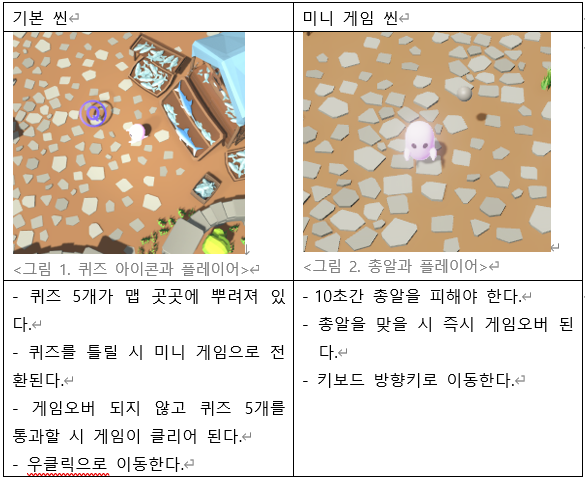
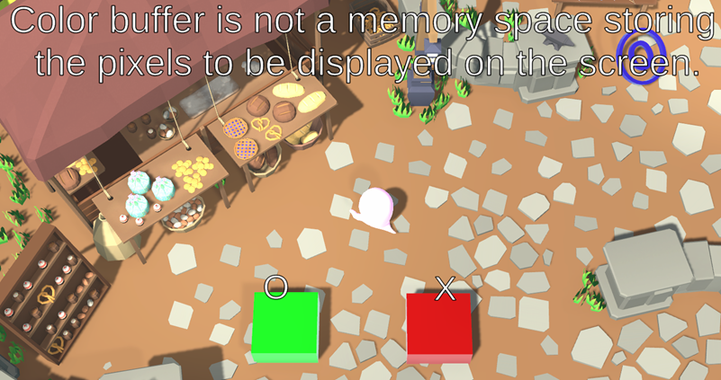
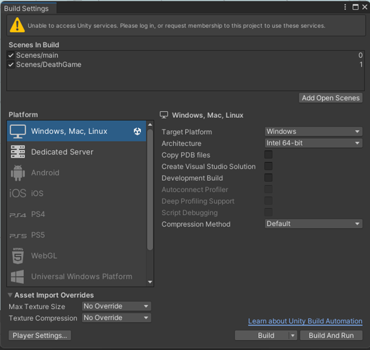

# 24_2_CG_Project_QuizFinder

- 게임 이름: Quiz Finder
- Contributors
  - 김병현([GitHub](https://github.com/jiiink))
  - 박규태([GitHub](https://github.com/kyoutae1234))
  - 박재선([GitHub](https://github.com/sunnypark87))
  - 이동훈([GitHub](https://github.com/bluelemon61))

## 게임 주제 및 배경

플레이어는 컴퓨터 그래픽스의 강의 내용을 복습하기 위해 퀴즈 섬으로 떠난다. 총 5개의 O/X 퀴즈가 있으며, 퀴즈를 틀릴 시 10초 동안 플레이어를 향해 총알이 날아오게 된다. 총알을 모두 피하며 퀴즈 5개를 통과한다면 게임을 클리어하게 된다.

## 사용한 Free Asset

- [Ghost character Free](https://assetstore.unity.com/packages/3d/characters/creatures/ghost-character-free-267003)
- [Low-Poly Medieval Market](https://assetstore.unity.com/packages/3d/environments/low-poly-medieval-market-262473)

## 게임 설명 및 스크린샷

## 빌드 방법

- `Scenes/main`, `Scenes/DeathGame` 포함하여 빌드
  
